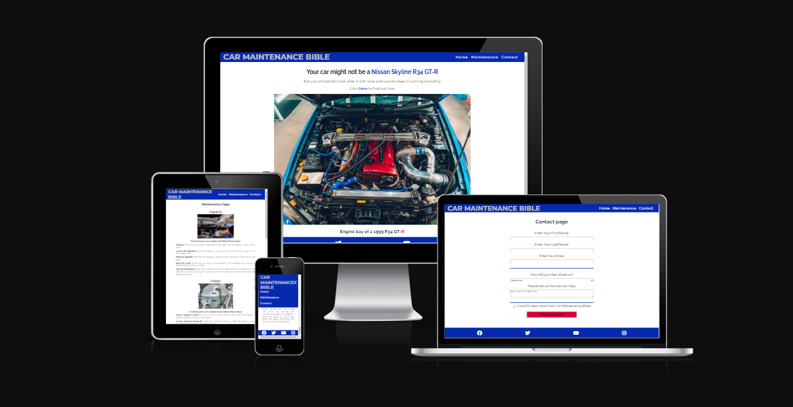
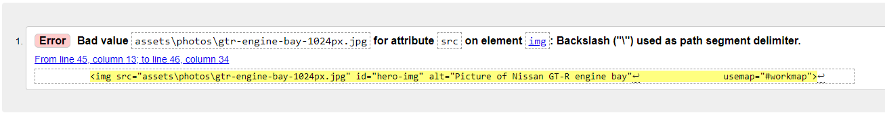
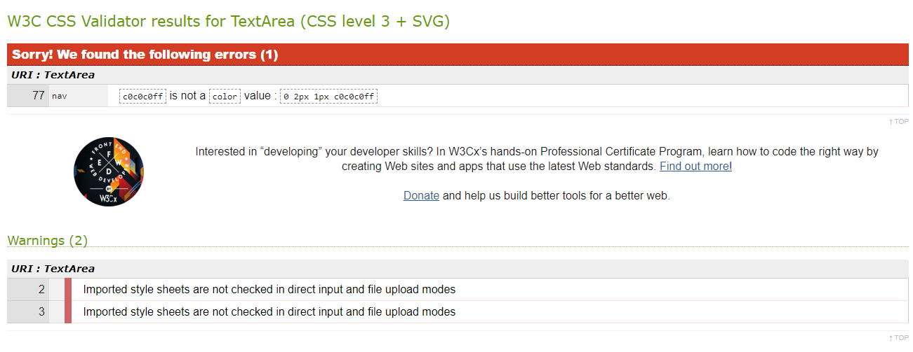

# Car Maintenance Bible
Car maintenance bible is the go to guide for people wanting to know the basic tasks they can undertake to take care of their car and keep it in good running order. The site is easy to navigate and provides the essential information to the user. The site is targeted towards all car owners whether a first timer or a veteran of the road. 

The site offers a contact page to get in touch if the user's questions are not answered after visiting the site. 
The site landing page contains a link to a Top Gear article about the same car that is used for the hero image on the landing page. This article was used to apeal to car enthusiasts and keep them enjoying car related content rather than using a wikipedia article where their attention could get drawn in other directions. This was purposely chosen to ensure the website focused on car based content.

Visit the site [here](https://fergal92.github.io/pp1-car-maintenance/index.html)



## Design
### Colours
I asked perplexity AI to suggest a good colour for a car maintenance website. It had varying suggestions. I settled on blue , red, white and silver as my colours of choice and used https://coolors.co/ to help pick the shade
```
/* CSS HEX */
international-klein-blue: #052ab0ff;  
white: #ffffffff;  
silver: #c0c0c0ff;  
fire-engine-red: #d5002eff;  
```
## Typography
I used Raleway and Montserrat as the fonts for the project. They are Sans Serif fonts. Perplexity AI suggested the use of these fonts for a car maintenance themed website. They worked well upon trial so i kept them. The fonts were found and imported from Google Fonts.

### Media
The icons were sourced from Font Awesome

The Favicons were taken for free from this website https://favicon.io/emoji-favicons/automobile

### Wireframes
Wireframes were created using Blasamiq. First draft wireframes of the different pages as viewed on a laptop


## Features

### Existing Features

#### Navigation Bar
- Featured on all three page, the fully responsive navigation bar includes a logo with link to the home page and three list items that link to the home page, maintenance page and the contact page.
- This section will allow users to navigate around the website without having to use the back button


#### Landing page image
- The landing page image is of an engine bay with an image map overlaid so that the user can click different part of the photo to be brought to the corresponding section on the maintenance page, for example, clicking the headlights brings the user to the lights section, clicking the engine brings the user to the engine oil section.
- The engine bay image is of a beautifully maintained Nissan Skyline R34 GT-R which is a legendary car among car enthusiasts.


#### The Footer
- The footer section includes links to relevant social media sites. The links open to a new tab to allow for easy navigation for the user.
- The footer sticks to the bottom of the page


#### Maintenance Page
- Includes all maintenace content
- content includes picture per item and is centered and justified
- each mainteance task is connected to the hero image map on index page


#### Contact Page
- The contact page will allow the user to contact the website for more specific questions and to subscribe to hear more from the car maintenance bible
- The user will be asked to submit their full name and and email address and to tick a checkbox to subscribe and to write their message


#### Thank You Page
- The thank you page thanks users for filling in the contact form
- It features the header and footer and a link in the main section to bring users back to the main site 


### Features left to implement 

- Further maintenance tasks
- More image maps for all parts of the car

## Testing
### Validator Testing

#### HTML
##### Index page


##### Maintenance page


#### CSS


All validation errors were fixed

### Accessibility
I confirmed that the colour and fonts are easy to read by running it through lighthouse in chrome devtools
I did this for each page of the website


### Bugs
- To link to an id on a seperate page found solution at https://stackoverflow.com/questions/20565644/how-to-link-to-a-div-on-another-page
- To change the colour of one letter solution at https://www.quora.com/How-do-I-change-color-of-one-letter-in-a-h1-tag
- To know which pixels where each engine part in hero image
	- open the photo in paint and click view rulers
	- https://html.com/images/how-to-make-an-image-map/
	- figured out the problem was that the usemap attribute needed a # before workmap to target it
- struggled with the footer. Could not get it right until I changed the body flex direction to column and then it sat vertically under the other sections.
- the drop down menu was opening on top of the image - need to push the top of image to the bottom of the dropdown menu. Increased the top margin of main to solve this.
- The img was not opening in the correct size since I had made the img smaller for mobile first - solved just spelling error on the media query.
- tablet size menu bar was covering top of main content still - solved with media query
- could not get the bullet points removed from the ordered list but the list items were not inside the OL element.
-  Changed font-sizes instead to rem units instead of % and the hero image was not centered anymore - solved with changing div width.
- changed hamburger icon to hand pointer when hovering over - https://stackoverflow.com/questions/3087975/how-to-change-the-cursor-into-a-hand-when-a-user-hovers-over-a-list-item
- Struggled to get the maintenance page content to sit nicely in the middle of the page. Eventually got it working by changing the width property for the different media queries
- Commit messages before mentor meeting 1 were bad practice. After the meeting the correct format was used
  
### Unfixed Bugs

The image map currently only works on screen sizes of 1040px and higher. I could not make the image map work at different sizes without javaScript
## Deployment

- The site was deployed on gitHub pages on day 1 of the project undertaking. Steps taken are as follows:
	- Inside the repo click the settings tab
	- Click on pages menu item on the side bar
	- Select the master branch and then click the link to go to the live site

The live link to the site can be found here https://fergal92.github.io/pp1-car-maintenance/index.html 
## Credits

### Content
- Perplexity AI was used to generate each of the maintenance steps found on the maintenance page
- The icons in the footer were taken from font awesome
- The fonts were taken from google fonts 
- The contact page was taken from a freecodecamp tutorial. I modified it to suit this project
### Media
- The photos used for the website were taken from a google image search. The photos and the link to the site they were found are listed below.
	- engine bay photo - https://www.meguiars.co.uk/showroom/detailing-bay-650bhp-full-stage-r34-gt-r/
	- battery - https://www.goauto.ca/tools-resources/how-to-test-your-battery-voltage
	- headlights - https://smartdriving.co.uk/Driving/Driving_emergencies/headlights.html
	- engine oil check - https://www.gulfoilltd.com/blog/when-should-you-check-the-engine-oil-level
	- coolant check - https://haynes.com/en-gb/tips-tutorials/how-check-and-change-your-car-s-coolant
	- wiper blades - https://www.sunsetnorthcarwash.com/2020/12/14/it-might-be-time-to-change-your-windshield-wiper-blades/

## External tools
- ### GitHub Projects
  	Link to the GitHub prject page that was used to manage the website build. Items were added to the kanban board and worked through.
	- https://github.com/users/fergal92/projects/1/views/2 
