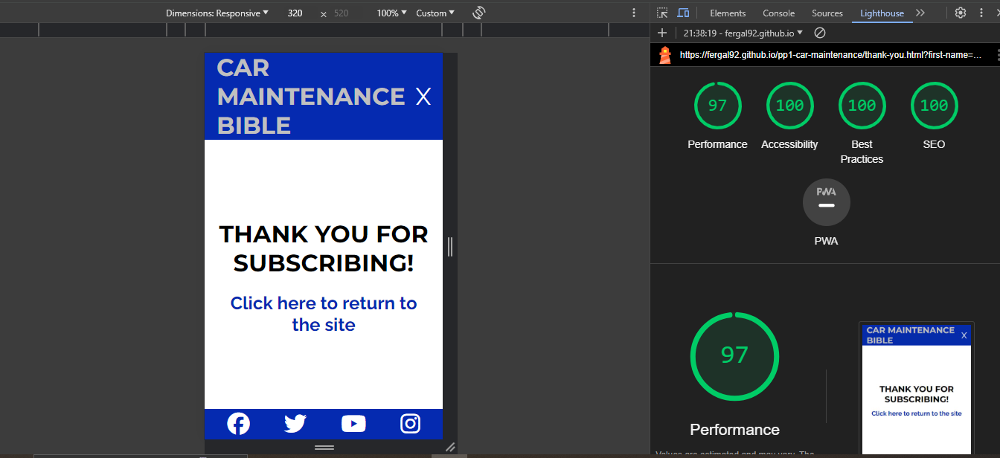

# Testing
## Compatibility
I confirmed the correct functionality, responsivness and appearence by testing the website in Chrome, Firefox and Edge browsers. The website worked without issue in all three.

Chrome browser: 

Firefox browser: 

Edge browser: 

## Responsiveness
The website was checked for responsiveness using the chrome extension "Responsive Viewer". All pages were tested. The website is fully responsive and has a mobile first design.

Index page: 

Maintenance page: 

Contact page: 

Thank you page: 

## Manual Testing
| feature | action | expected result | tested | passed | comments |
| --- | --- | --- | --- | --- | --- |
| Navbar | | | | | |
| Home | Click on the "Home" link | The user is redirected to the main page | Yes | Yes | - |
| Maintenance | Click on the "Maintenance" link | The user is redirected to the gallery page | Yes | Yes | - |
| Contact | Click on the "Contact" link | The user is redirected to the contact page | Yes | Yes | - |
| Footer | | | | | |
| Instagram icon in the footer | Click on the Instagram icon | The user is redirected to the Instagram page | Yes | Yes | - |
| Facebook icon in the footer | Click on the Facebook icon | The user is redirected to the Facebook page | Yes | Yes | - |
| Twitter icon in the footer | Click on the Twitter icon | The user is redirected to the Twitter page | Yes | Yes | - |
| YouTube icon in the footer | Click on the YouTube icon | The user is redirected to the YouTube page | Yes | Yes | - |
| Index page | | | | | |
| "Nissan Skyline R34 GT-R " link | Click on the "Nissan Skyline R34 GT-R " link | The user is redirected to an external link of a skyline review on top-gear website | Yes | Yes | - |
| "click here " link | Click on the "click here " link | The user is redirected to the maintenance page | Yes | Yes | - |
| Image map | Click on the image map - various different places | The user is redirected to the maintenance page section that relates to the area of the image they clicked| Yes | Yes | 1024px and over only |
| Contact page | | | | | |
| First name input | Enter Your First Name | The first name is entered | Yes | Yes | If user doesn't enter the first name, the error message appears |
| Last name input | Enter Your Last Name | The last name is entered | Yes | Yes | If user doesn't enter the last name, the error message appears |
| Email input | Enter Your Email | The email is entered | Yes | Yes | If user doesn't enter the email, the error message appears. If user enters not valid email, the error message appears |
| How did you hear about us drop down menu | Click the drop down menu | The drop down menu appears | Yes | Yes | The user is not required to select a drop down list item |
| Please tell us how we can help textarea | The user fills in their message | The message is entered | Yes | Yes | The user is not required to enter input in this textarea|
| I want to hear more checkbox | Click on the checkbox | The checkbox is checked | Yes | Yes | The error message appears unless the checkbox is checked as these checkboxes are required |
| "Rev your engines" button | Click on the "Rev your engines" button | The user is redirected to the thank you page | Yes | Yes | - |
| Thank you page | | | | | |
| Thank you message | The user clicks on the return to home page link| The user is redirected to the home page | Yes | Yes | - |

### Validator Testing

#### HTML
##### Index page

##### Maintenance page

#### CSS

All validation errors were fixed

### Accessibility
I confirmed that the colour and fonts are easy to read by running it through lighthouse in chrome devtools
I did this for each page of the website

Index page: 

Maintenance page: 

Contact page: 

Thanl you page: 

## Bugs
### Solved bugs
- I could not get the website to link to other html pages of the website. I utilised a solution from the following link and adapted it to my site - https://stackoverflow.com/questions/20565644/how-to-link-to-a-div-on-another-page
- To change the colour of one letter solution at https://www.quora.com/How-do-I-change-color-of-one-letter-in-a-h1-tag
- In order for the image map to work correctly I needed to know which pixels in the image matched up to each particular engine bay component. I utilised the following website to find the solution - https://html.com/images/how-to-make-an-image-map/
- I could not get the footer to sit correctly at the bottom of the page even with margin-top set to auto. I changed the body flex direction to column and then it sat vertically under the other sections. This was the solution.
- The drop down menu was opening on top of the image - need to push the top of image to the bottom of the dropdown menu. Increased the top margin of main element to solve this. Then I had to make it responsive as the margin size differed at various resolutions.
- I changed hamburger icon to hand pointer when hovering over. Solution found at this website - https://stackoverflow.com/questions/3087975/how-to-change-the-cursor-into-a-hand-when-a-user-hovers-over-a-list-item
- Struggled to get the maintenance page content to sit nicely in the middle of the page. Eventually got it working by changing the width property for the different media queries.
  
### Unsolved Bugs
- No unsolved bugs

## Mistakes
- Commit messages before mentor meeting 1 were bad practice. After the meeting the correct format was used.